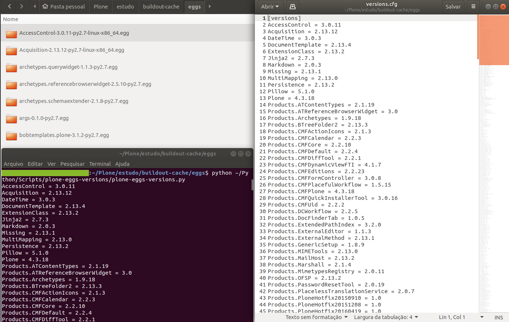

# My Plone Eggs
> List all Plone Eggs versions

A Python script to list Plone Eggs versions from your instance to a versions.cfg file



### Usage

Just download the script and run from a terminal in the Eggs directory

```
python plone-eggs-versions.py
```

### Purpose

A method to backup all the Eggs versions running normally in a Plone instance to a cfg file. 

### Author

Thiago Calazans - me